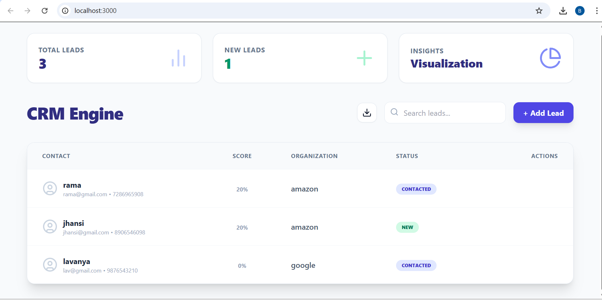
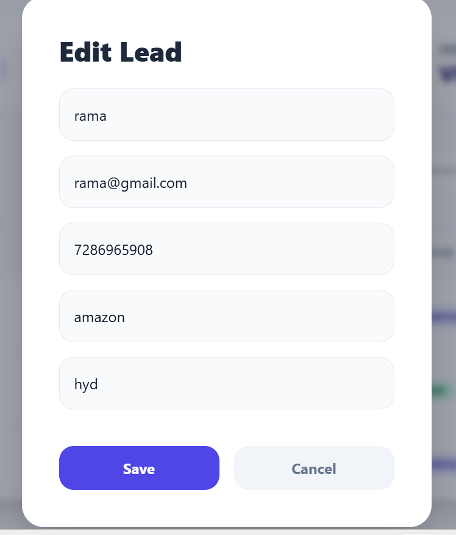
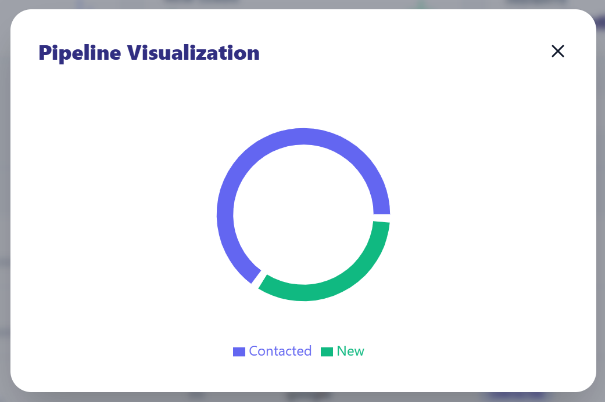

# AI-Driven Customer Relationship Management (CRM) Engine

A modern, full-stack CRM solution built with **FastAPI** and **React** designed to automate lead prioritization and streamline sales workflows.

## 📌 Project Overview
The **CRM Engine** is a high-performance application that manages the lifecycle of a sales lead from initial contact to conversion. It replaces static spreadsheets with a dynamic, data-driven dashboard that calculates lead engagement in real-time.
## 📸 Demo & Interface
<p align="center">
  
</p>
### Lead Management
<p align="center">
  

</p>

### 📊 Pipeline Visualization
<p align="center">
  
</p>


* Kindly Download the Project to Explore more Features 


### The Problem It Solves
* **Lead Fatigue**: Traditional systems don't tell sales reps who to call first; this system uses an engagement algorithm to highlight "Hot Leads".
* **Data Redundancy**: Prevents "Database Pollution" by blocking duplicate entries based on unique identifiers like email.
* **Fragmented Context**: Consolidates mobile, address, company data, and interaction history into a single source of truth.

## 💡 Why This Project is Unique

- 🔥 **Automated Lead Scoring System**
- ⚡ **Real-Time Search Across Multiple Fields**
- 📊 **Live Data Visualization Dashboard**
- 🚫 **Duplicate Data Prevention Logic**

---

## 🛠 Project Modules

### 1. Lead Management & Data Integrity Module
This module handles the core "Customer" entity.
* **Advanced CRUD**: Supports creating, reading, updating, and deleting leads with full data persistence.
* **Duplicate Elimination**: A backend interceptor checks for existing email records before allowing a new lead to be saved, ensuring data quality.

### 2. Intelligent Scoring & Interaction Module
The "Brain" of the CRM that tracks engagement.
* **One-to-Many Relationship**: Maps multiple interaction notes to a single customer record using SQLAlchemy Foreign Keys.
* **Scoring Algorithm**: Automatically updates the lead's temperature (Cold/Warm/Hot) based on the formula: $score = \min(\text{interactions} \times 20, 100)$.

### 3. Smart Search & Filtering Module
An optimized UI layer for rapid data retrieval.
* **Multi-Column Filter**: Allows users to filter records instantly by Name, Email, Company, Mobile, or Location.
* **Case-Insensitive Indexing**: Ensures search results return regardless of capitalization.

### 4. Data Visualization & Export Module
Provides executive-level insights and data portability.
* **Pipeline Visualization**: Uses `Recharts` to generate a real-time Pie Chart of lead status distribution.
* **CSV Export Engine**: Includes a **Download Button** to export the lead database into `.csv` format for offline analysis.
* **Dynamic Indicators**: Features a "HOT LEAD" pulse animation for leads with a 100% engagement score.

---

## 💻 Tech Stack & Tools

### Frontend
* **React.js**: Library for building the dynamic user interface.
* **Tailwind CSS**: For modern, responsive utility-first styling.
* **Lucide React**: High-quality vector icons for better UX.
* **Recharts**: Composable charting library for data visualization.

### Backend
* **FastAPI**: High-performance Python framework for building APIs.
* **SQLAlchemy**: SQL Toolkit and Object-Relational Mapper (ORM).
* **SQLite**: Lightweight relational database for local storage.
* **Uvicorn**: Lightning-fast ASGI server implementation.

### Development Environment & Editors
* **Editor**: Visual Studio Code (VS Code).
* **Version Control**: Git & GitHub.
* **Package Managers**: npm (Node) and pip (Python).

---


## 🚀 Installation & Setup

### Prerequisites
* **Python 3.8+**
* **Node.js (v14+) & npm**

### 1. Backend Setup (FastAPI)
```bash
cd backend
pip install -r requirements.txt
uvicorn main:app --reload
```
The backend will run at http://127.0.0.1:8000.


### 2. Frontend Setup (React)
```bash
cd frontend
npm install
npm start
```
The frontend will open automatically at http://localhost:3000.
